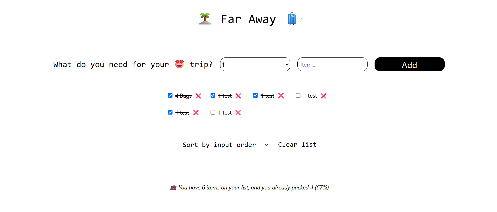
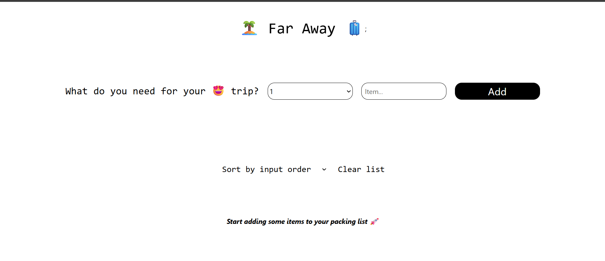

# React Basic

This repo contains the source code of the React to Todo List Using global state management useContext and how to handle data with context

## Preview




## How To Run This Project

1. Clone this repository:

   ```bash
   git clone "https://github.com/HN721/fgo24-react-todo.git"
   ```

2. Install dependencies:

   ```bash
   npm install
   ```

3. Make sure you have installed the following dependency:

   ```
   vite
   tailwind
   ```

4. Start the project with:

   ```bash
    npm run dev
   ```

5. The project will run at: http://localhost:5501

---

## Contributing

We welcome contributions! 🚀

If you would like to open a Pull Request (PR), please follow these steps:

1. Fork this repository.

2. Create a new branch:

```
git checkout -b feature/your-feature-name
```

3. Make your changes.

4. Commit your changes with a clear message:

```
git commit -m "Add: your featusre description"
Push your branch to your fork:
```

```
git push origin feature/your-feature-name
```

5. Open a Pull Request (PR) to the main branch of this repository.

6. Make sure your code is clean, well-tested, and consistent with the project style.

7. License
   This project is open-source and available under the MIT License.

# Enjoy exploring and contributing to the Survey Application! 🎉
